# README

## Course introductions

The course “Biological Big Data Analysis” is an elective for the 3rd year students majoring in bioinformatics. Students from the life science school and other related majors are also encouraged to attend. Based on the latest research of big data in biological field, this course will introduce the whole chain of the data collection,cleansing, analysis, modelling and application

In the 16 weeks of this course, students will learn the new concepts and latest research of biological big data,commonly used and state-of-the-art algorithms, practical processing and software use on big data, meta-analysis of clinical data, imaging data, omics data and semantic data, future development of big data and precision medicine.

Every student in classes is able to keep up to date with latest research of big data, and master practical skills of analyzing,modelling, programming, computing and demonstrating of big data problems by finishing the homework and team project in this course.

## Project introductions

In this course, we learnt about commonly used machine learning and deep learning algorithms, which corresponded to two assignments/projects.

In the `Machine learning homework` folder, I completed the following two assignments

+ Complete binary prediction of heart-disease dataset using machine learning algorithms (decision tree algorithm and KNN algorithm were used)

  Their performance is shown below:

  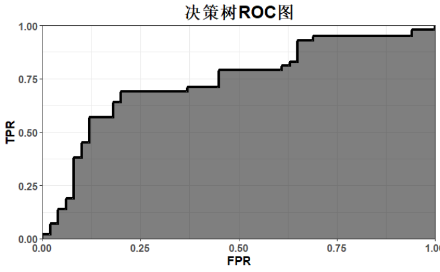

  Performance of the KNN algorithm:

  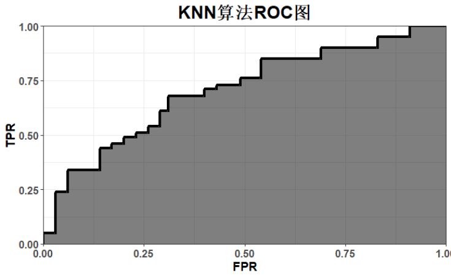

+ Clustering of Iris dataset done using machine learning algorithms (DBSCAN and K-means algorithms used)

  The real situation of the Iris dataset is shown below:

  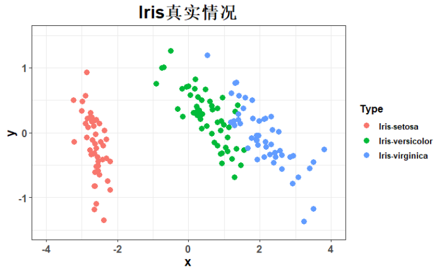

  And the Kmeans algorithm clustering result is as follows:

  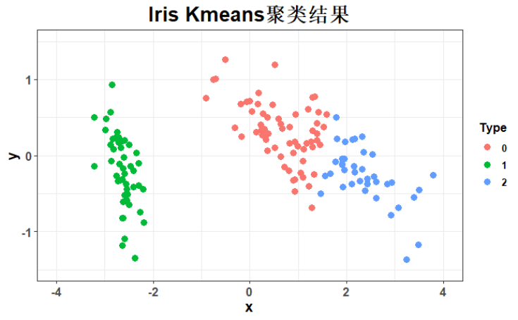

  The DBSCAN algorithm clustering results are as follows:

  

In the `CNN RNN project` folder, it shows the process and results of our implementation of image classification, text classification and other functions using CNN and RNN networks. In the `CNN-black` folder, I used pytorch to build a CNN to classify the symbol dataset "final_symbol_split". In the `CNN-colour` folder, I also used CNN to classify the `cifar` dataset. The `RNN` file contains the code and results (including loss function images, prediction results, etc.) of my RNN construction for protein sequence secondary structure prediction. Also, `Description.pdf` is a detailed description of the project; and `Report.pdf` is the final project report.

### `CNN-black`

The `final_symbols_split_ttv` dataset contains more than 50,000 images, labelled with 14 categories of 0-9 numbers and quadratic symbols. The image data are all grey scale images with a resolution of 150*150. For this dataset, our goal is to build a convolutional neural network model to implement the multi-classification problem.  

In the `CNN-black` folder, we give two algorithm implementations of CNN, mlp.

For CNN, the value of its iterative loss function during training is:

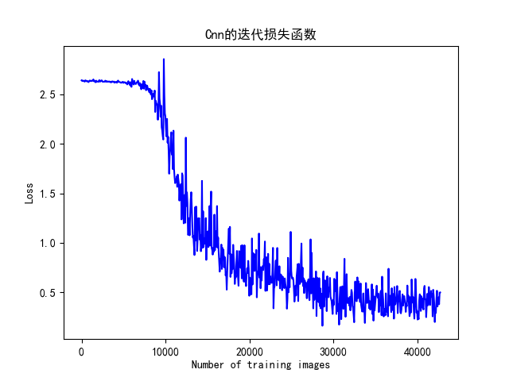

Its prediction results are displayed roughly as:

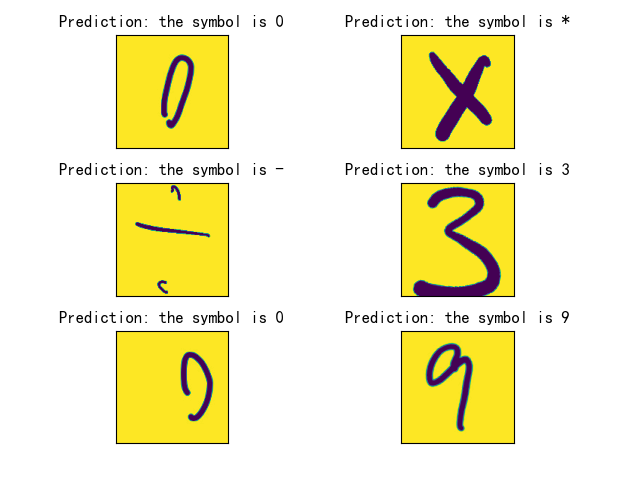

For MLP, its training-time iterative loss function value is:

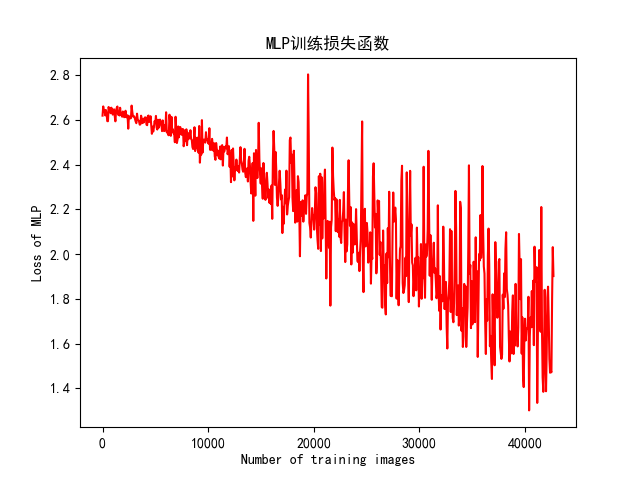

Its prediction results are displayed as:

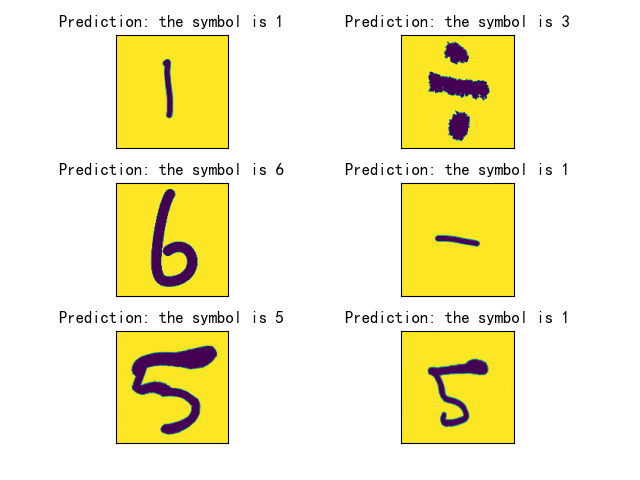

### `RNN`

The `PDB_protein_sst3` dataset contains more than 16,000 protein sequence data, and the tag sst3 classifies the secondary structure corresponding to each residue in the sequence, including H (various helix structures), E (𝛽-strand and 𝛽-bridge), and C (loop, etc.). other irregular structures). Protein sequence information is stored in the seq column; tags are stored in the sst3 column, where each residue of the protein sequence corresponds to a tag. Our goal is to use recurrent neural network models to solve the secondary structure triple classification problem at the residue level for a given protein sequence.  

And for the specific implementation, we use two algorithms, ordinary RNN and MLP.

For RNN, its iterative loss function value during training is shown in Fig:

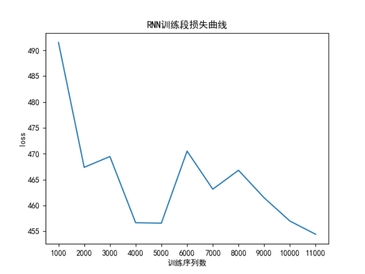

The prediction results are shown as:

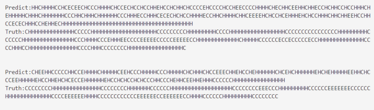

And the loss function value of the MLP algorithm is:

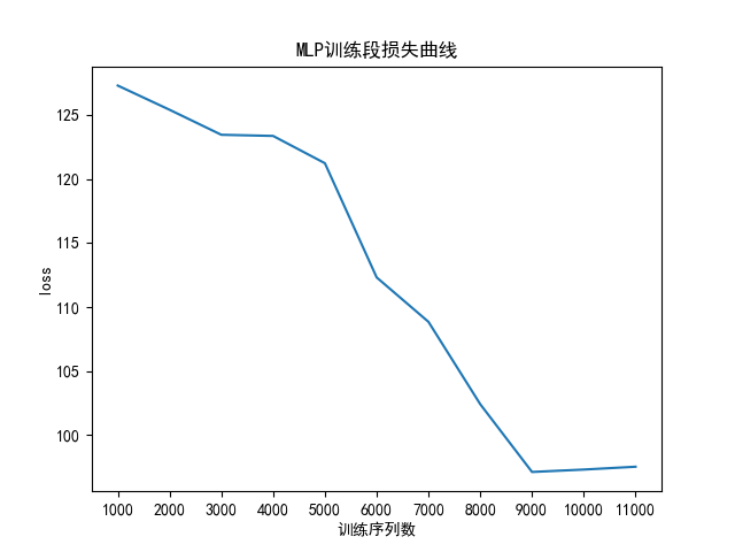

## Project introductions

在该课程中，我们主要学习了常用的机器学习和深度学习算法，其对应了两次作业/项目。

在`Machine learning homework`文件夹中，我完成了以下两个任务

+ 利用机器学习算法完成heart-disease数据集的二分类预测（使用了决策树算法和KNN算法）

  它们的表现如下图所示：

  

  KNN算法的表现：

  

+ 利用机器学习算法完成Iris数据集的聚类（使用了DBSCAN和K-means算法）

  Iris数据集的真实情况如下图所示：

  

  而Kmeans算法聚类结果如下：

  

  DBSCAN算法聚类结果如下：

  

在`CNN RNN project`文件夹中，展示了我们使用CNN、RNN网络实现图像分类、文本分类等功能的过程与结果。在`CNN-black`文件夹中，我使用pytorch搭建了CNN完成了数字符号数据集"final_symbol_split"的分类。在`CNN-color`文件夹中，我同样使用了CNN完成了`cifar`数据集的分类。在`RNN`文件中，包含了我搭建RNN进行蛋白质序列二级结构预测的代码及结果（包括损失函数图像、预测结果等）。同时，`描述.pdf`是项目的详细介绍；而`报告.pdf`是最终的项目报告。

### `CNN-black`

`final_symbols_split_ttv` 数据集包含 50000 多张图片，标签分别是 0-9 的数字和四则运算符号共 14 类。图片数据均是分辨率为 150*150 的灰度图像。针对该数据集，我们的目标是搭建卷积神经网络模型实现多分类问题。  

在`CNN-black`文件夹中，我们给出了CNN、mlp两种算法实现。

对于CNN，其训练时迭代损失函数值为：

其预测结果展示大致为：

对于MLP，其训练时迭代损失函数值为：

其预测结果展示为：

### `RNN`

`PDB_protein_sst3` 数据集包含 16000 多个蛋白质序列数据，标签 sst3 为序列中每个残基对应的二级结构分类，包括 H（各种 helix 结构）、E（𝛽-strand 和𝛽-bridge）和 C（loop 等其他不规则结构）三类。蛋白序列信息储存在 seq 列中；标签储存在 sst3 列中，蛋白序列的每一个残基对应一个标签。我们的目标是使用循环神经网络模型解决给定蛋白序列的残基级别的二级结构三分类问题。  

而在具体实现时，我们使用了普通RNN、MLP两种算法。

对于RNN，其训练时迭代损失函数值如图所示：

预测结果展示为：

而MLP算法的损失函数值则为：

